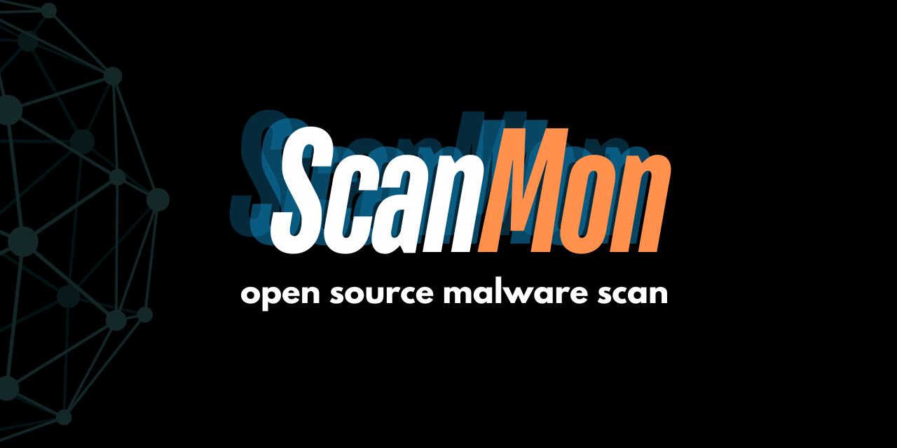

# ScanMon

ScanMon is a Node.js-based command-line interface (CLI) tool that leverages ClamAV for virus scanning and database updates. It provides an easy-to-use interface for scanning various directories on your system for potential threats.

## Features

- Integrates with ClamAV for robust virus scanning
- Allows updating of ClamAV virus definitions database
- Provides options to scan predefined vulnerable directories or custom paths
- Displays real-time scan progress with a progress bar
- Summarizes scan results, including infected file count and scan duration

## Prerequisites

Before you begin, ensure you have met the following requirements:

- Node.js (v14.0.0 or later)
- npm (usually comes with Node.js)
- ClamAV installed on your system

## Installation

1. Clone the repository:
   ```
   git clone https://github.com/yourusername/scanmon.git
   cd scanmon
   ```

2. Install the dependencies:
   ```
   npm install
   ```

3. Ensure ClamAV is installed on your system:
   - For macOS: `brew install clamav`
   - For Ubuntu/Debian: `sudo apt-get update && sudo apt-get install -y clamav clamav-daemon`
   - For Fedora/CentOS: `sudo dnf install -y clamav clamav-update`

## Usage

To run ScanMon, use the following command:

```
node scanmon.js
```

Follow the on-screen prompts to:
1. Choose whether to update the ClamAV database
2. Select a predefined set of directories to scan or specify a custom path
3. View the scan progress and results

## Configuration

ScanMon uses default paths for ClamAV configuration and databases. If your ClamAV installation uses non-standard paths, you may need to modify the following files:

- `utils.js`: Update the `ensureDirectories` function with the correct paths for your system.
- `scanner.js`: Modify the `updateDatabase` function if your `freshclam` command requires different parameters.


On a Darwin-based system (macOS), some paths are more vulnerable to malware and exploitation than others. Here's a breakdown of paths to prioritize for scanning and those that can be skipped:

# High-priority paths to scan:
### System directories:
/System/Library/
/Library/
/usr/lib/
/usr/local/lib/
### Application directories:
/Applications/
~/Applications/ (user-specific)
### Script directories:
/etc/rc.d/
/etc/init.d/
/Library/StartupItems/
### User directories:
~/Downloads/
~/Documents/
~/Desktop/
### Log files:
/var/log/
# Medium-priority paths to scan:
### Cache directories:
~/Library/Caches/
/var/cache/
### Temporary directories:
~/Library/Application Support/
/var/tmp/
### Network directories:
/Network/
/Volumes/ (network-mounted volumes)
# Low-priority paths or skip:
### System files:
/System/Library/CoreServices/
/usr/standalone/
### Cache and temporary files:
/private/var/folders/ (system cache)
/private/var/tmp/ (system temporary files)
### Backup directories:
~/Library/Application Support/Backup/
/private/var/backup/

# Note:
* Be cautious when scanning system directories, as false positives can occur.
* Prioritize scanning directories with executable files (e.g., .app, .bundle, .dylib, .so).
* Consider excluding directories with known safe files, like system fonts or language resources.
* Regularly update your antivirus software to ensure the latest malware signatures and detection capabilities.
* Keep in mind that this is not an exhaustive list, and specific use cases may require additional paths to be scanned. 
* Always consult your antivirus software's documentation for recommended scanning paths and configurations.

## Contributing

Contributions to ScanMon are welcome. Please follow these steps to contribute:

1. Fork the repository
2. Create a new branch (`git checkout -b feature/AmazingFeature`)
3. Make your changes
4. Commit your changes (`git commit -m 'Add some AmazingFeature'`)
5. Push to the branch (`git push origin feature/AmazingFeature`)
6. Open a Pull Request

## License

Distributed under the MIT License. See `LICENSE` file for more information.

## Contact

James - - jchrisa@me.com

Project Link: [https://github.com/yourusername/scanmon](https://github.com/yourusername/scanmon)

## Acknowledgements

- [ClamAV](https://www.clamav.net/)
- [Node.js](https://nodejs.org/)
- [Inquirer.js](https://github.com/SBoudrias/Inquirer.js)
- [cli-progress](https://github.com/npkgz/cli-progress)
